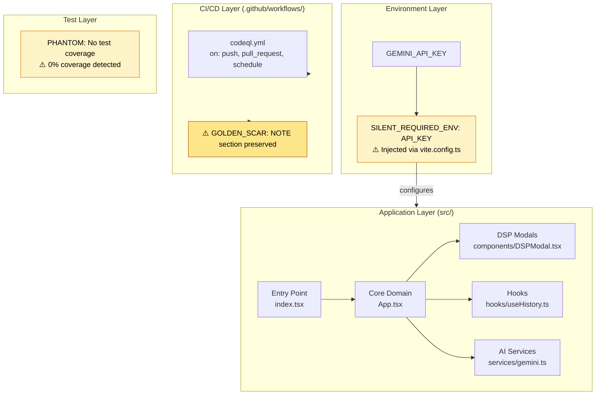
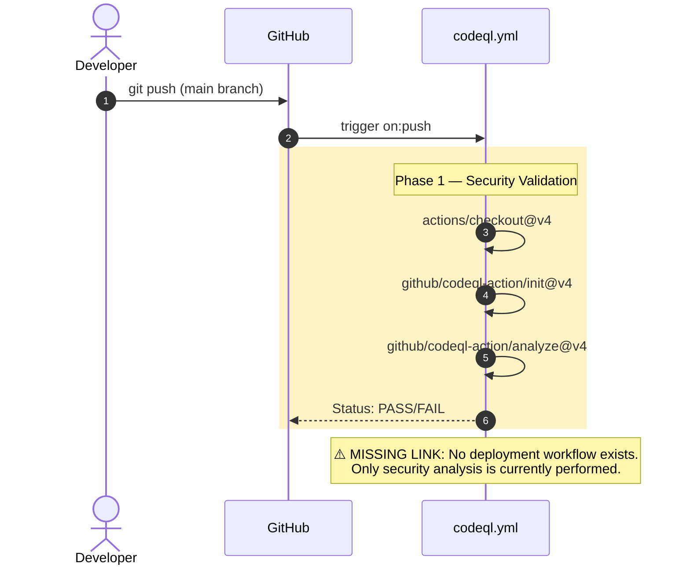

# Architecture Topology Map

Generated via Mycelial CI Trace (DRP_7_PATTERN_MODEL).
Betti-1 Cycle Status: CLEAN
Dependency Graph Depth: 4

# CI/CD Pipeline Cartograph

AST-to-YAML Reverse Trace complete. Temporal Flow: Left → Right = Commit → Production.

